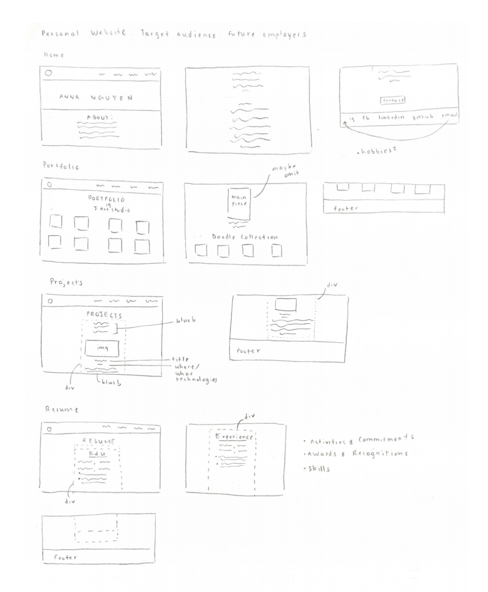
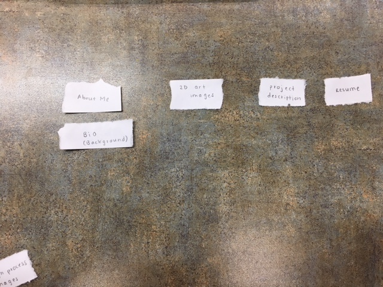
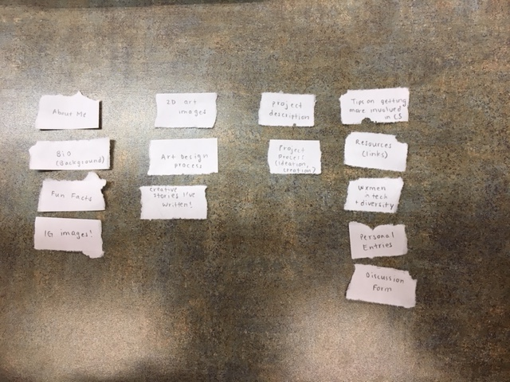
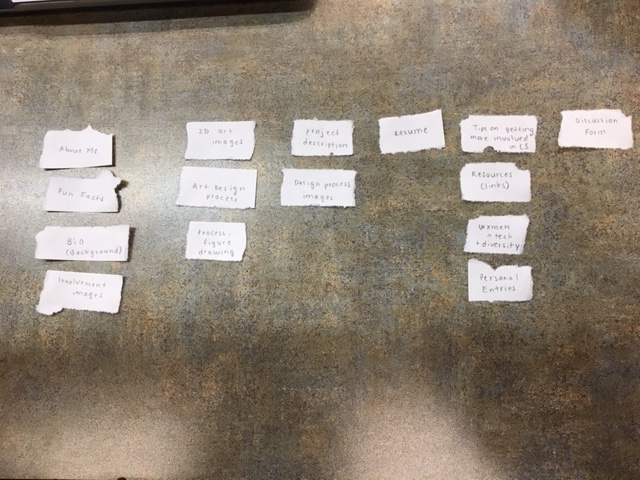
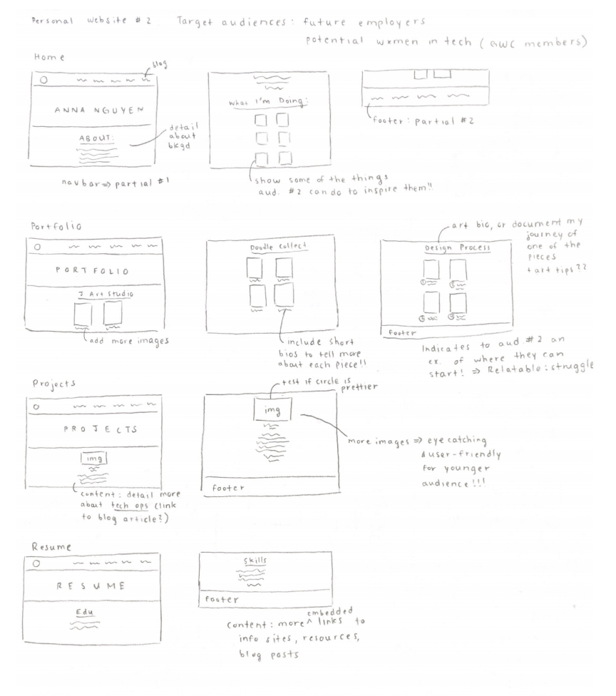
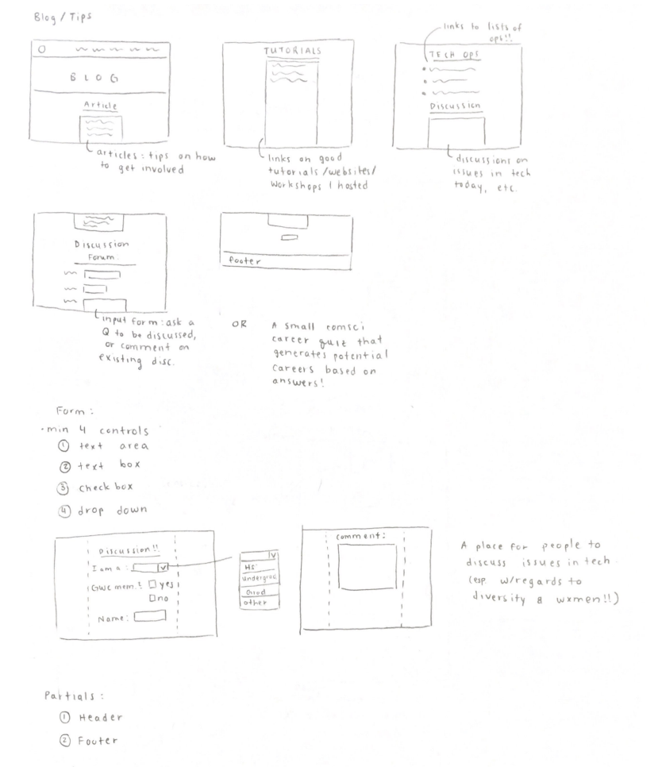
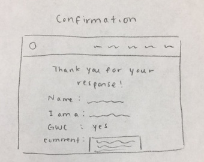
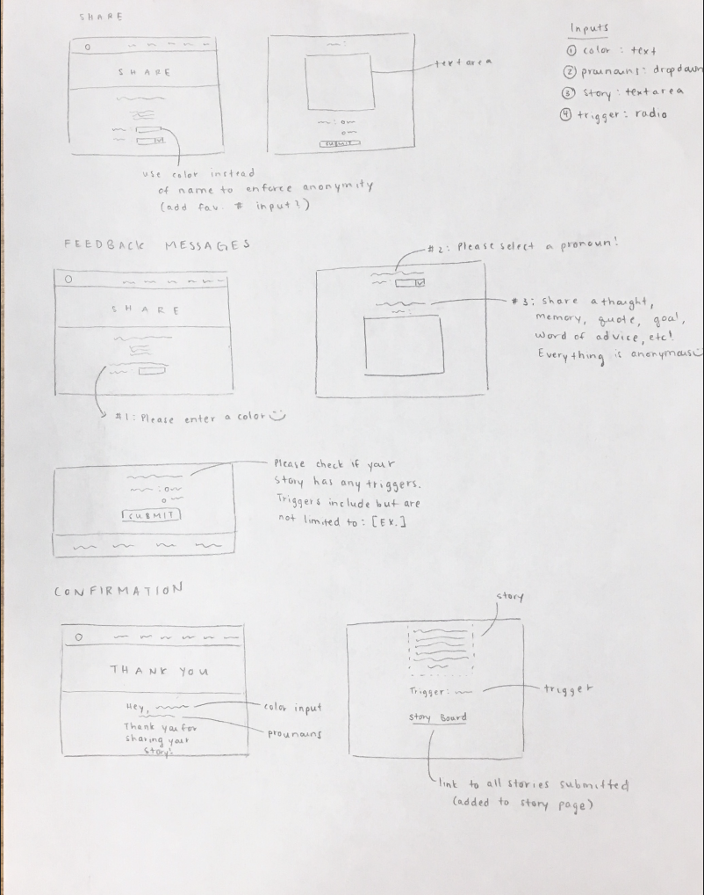
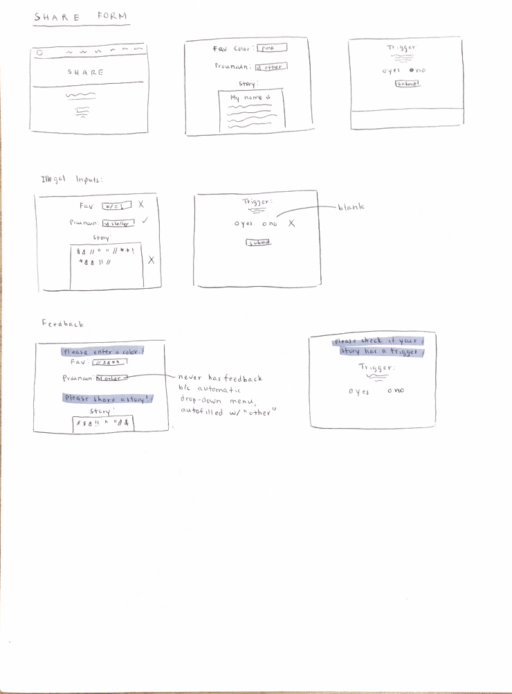

# Project 1: Design Journey

Be clear and concise in your writing. Bullets points are encouraged.

**Everything, including images, must be visible in Markdown Preview.** If it's not visible in Markdown Preview, then we won't grade it. We won't give you partial credit either. This is your warning.

## Existing Design, Planning, & Refined Design (Milestone 1)

### Existing Site: Target Audience I (Milestone 1)
> Who is your _existing_ site's target audience?
  * Future employees

### Existing Site: Target Audience I Needs (Milestone 1)
> Document your existing site's target audience's needs.
> List each need below. There is no specific number of needs required for this, but you need enough to do the job.

- Need #1: [Resume]
  - **Need**
    - > What does your existing target audience need?

      Future employers need access to my resume to determine quickly if my personality and skills match their companys' vision.
  - **Design Choices**
    - > How does your existing site meet this need?

      My existing site meets this need by providing a Resume Page, which gives quick access through the navbar to future employers. Recruiters can simply scan the resume page instead of skimming through the entire website (although preferably, employers are on the website to view all content) to facilitate the hiring process.
- Need #2: [About]
  - **Need**
    - > What does your existing target audience need?

      Future employers need to learn about me and my background, particularly what motivates me to pursue CS and IS (UX/UI Design).
  - **Design Choices**
    - > How does your existing site meet this need?

      My existing site meets this need by providing an extensive background about my early dabbles into computer science and later involvement in the Girls Who Code club at my high school. I detail how computer science and art connect together for me, which inspired my interest in UX/UI Design as a combination of both technology, art, and people. Employers can get to know what drives me as a potential worker.
- Need #3: [Past Works & Experiences]
  - **Need**
    - > What does your existing target audience need?

      Future employers need to see my past works and experience in order to gauge my skill level, as well as see my coding style. They need this to gauge if I can work on a team and write clean code with good documentation. Additionally, employers need to see my ambition behind these projects, and whether I took the initiative to create personal projects on my own, which demonstrates ambition and self-intiative (qualities that are good in a leader/worker).
  - **Design Choices**
    - > How does your existing site meet this need?

      My site meets this need by having a "Projects" page detailing the most significant projects I have partaken in throughout my CS career. Each project contains a description of my role on the team, as well as the technologies used in order to provide a brief overview of what the project is and does. Furthermore, I link my GitHub account to the footer of each page, allowing employers to access my repositories and not only see the projects I have highlighted on my page, but other projects I may be working on.
- Need #4: [Portfolio]
  - **Need**
    - > What does your existing target audience need?

      Future employers need access to my digital and art portfolio in order to gauge my abilities as a potential UX/UI Designer. I have no digital design experience, and so my portfolio contains no digital designs, but I aim to add a collection in the future. Here, employers can see my artistic abilities which creates depth in my resume outside of technical projects. Employers may see this as a benefit to their team.
  - **Design Choices**
    - > How does your existing site meet this need?

      My existing site meets this need by containing an individual "Portfolio" page in the navbar, which provides quick access to my 2D art portfolio. Additionally, the page itself has various images of works I've done in the past spanning across multiple medias including acrylic, gouache, and 3D mixed media. I plan to add descriptions in the future which will tell employers more about each project and the time, patience, and effort put into each piece.
- Need #5: [Personality]
  - **Need**
    - > What does your existing target audience need?

      Future employers need to *see* my personality embedded into my personal website. Thus,they should view various qualities and skills that I display through not only my works, but the way I structure my content, and the language I use to draw people in. They need to gauge my personality in order to take interest in my potential as a hiree and see if I can work well within a team in their company vision.
  - **Design Choices**
    - > How does your existing site meet this need?

      My existing site meets this need by displaying various components that each imply parts of my personality and skill level. For example, in the "Projects" page, I want to project a lighthearted tone, so I included the "Status" banner.


### Existing Site: Design/Sketches (Milestone 1)
> Sketch your existing site. Include these sketches here.
> DO NOT COPY SKETCHES FROM THE ORIGINAL ASSIGNMENT! Create new sketches here. This is part of the design process to get you thinking about the strengths/weaknesses of the current design.
> Provide a brief explanation _underneath_ each sketch.



The website contains 4 pages: About, Portfolio, Projects, and Resume in order to provide future employers with a full access to the extent of my technical and artistic skills/abilities.

### Refined Site: Target Audience II (Milestone 1)
> Who is your additional/secondary target audience?
  * High school students with an interest in CS, especially Girls Who Code members

### Refined Site: Target Audience II Needs (Milestone 1)
> Document target audience II's needs.
> List each need below. There is no specific number of needs required for this, but you need enough to do the job.

- Need #1: [Inspirations]
  - **Need**
    - > What does your target audience II need?

      Younger audiences need inspirations to kindle their interest in CS, which can come in many forms including potential projects they could learn how to do, inspiring women in tech, and self-driven workshops or easy courses that can get them started!
  - **Design Ideas and Choices**
    - > How will you refine your site's design to meet this need?

      I will include a blog page that provides links to resources that younger audiences can refer to. Additionally, I will include more projects in my "Projects" page that are easier level and demonstrate my earliest projects, which were very rough to indicate that it takes time and effort to become better at computer science, just like everything else.
- Need #2: [Resources]
  - **Need**
    - > What does your target audience II need?

      They will need tech resources, including opportunities for internships, conferences, networking, etc., as well as resources to get started on personal projects on their own such as mini workshops and tutorial links!
  - **Design Ideas and Choices**
    - > How will you refine your site's design to meet this need?

      In my "Blog" page, I will add a section for these opportunities and compile a list to include within the site.
- Need #3: [CS Information]
  - **Need**
    - > What does your target audience II need?

      Many GWC members come in not knowing what computer science is, but hearing it around a buzz word in today's society and technology industry. They need to understand what computer science really is, its limitations, difference between other areas that may be comfused with CS (i.e. IT) and what they can create using computer science skills.
  - **Design Ideas and Choices**
    - > How will you refine your site's design to meet this need?

      I will add more content focused on my design process that relate back to what CS is, and include articles in the "Blog" page that define CS. I may include a FAQ page with commone myths/misunderstandings in CS to define what it really is!


### Refined Site: Content Organization/Navigation (Milestone 1)
> Identify the content that is necessary for both target audiences.
> List the content here.
> Don't forget to include the form.

- Design processes
- Extracurricular + tech involvement
- Timeline of my development as a computer scientist


> Organize the content for the target audience and identify possible pages for the content using card sorting.
> First, organize the content for target audience I. Document your card sorting by taking a photo and including it here.



> Second, organize the content for target audience II. Document your card sorting by taking a photo and including it here.



> Next, organize the content for both target audiences. Document your card sorting by taking a photo and including it here.



> Lastly, list the pages that resulted from your final card sort (i.e. your site's navigation).

- Home
- Portfolio
- Projects
- Resume
- Blog
- Discussion Form


### Refined Site: Design (Milestone 1)
> Refine the design of your site to meet the needs of _both_ target audiences.
> Include sketches of each page of the refined design.
> Provide a brief explanation _underneath_ each sketch.
> Document your _entire_ design process. **Show your preliminary sketches and your final sketches.**
> Don't forget the form and confirmation page!



Home page now has more images of the things I've done in the past, including extracurriculars (essentially how I got more involved in tech). Portfolio now details my design processes for some select pieces and has more descriptions of each of the pieces. Projects will be reorganized into a more eye-catching layout for younger audiences. Resume will remain mostly the same for purposes of future employees, but can act as a template for younger audiences.



Blog will mainly be for younger audiences, providing tips, resoures, and articles about tech and CS. However, future employees can check it out to see my thought processes and find more detail about my extracurriculars/myself. There will be a discussion form page, where GWC members can discuss issues in the tech space, particularly with regards to diversity and women in tech.




### Partial Plan (Milestone 1)
> Using your refined sketches, plan your site's partials.
> You may describe each partial or sketch it. It's up to you!
1. Header: navbar & profile icon
2. Footer: External links, and icon picture source

---

## Sticky Form Planning (Milestone 2)

### Sticky Form (Milestone 2)
> What controls do you need for your form?
  * Favorite color: text input
  * Pronouns: drop down (select)
  * Your Story: textarea
  * Trigger: radio controls

> Plan out your feedback messages for your form. You may sketch (probably the easiest) or write it out.
  
  
  1. Please enter a color :)
  2. Please select a pronoun!
  3. Share a thought, memory, quote, goal, word of advice, etc! Everything is anonymous :)
  4. Please check if your story has any triggers. Triggers include but are not limited to: (provide examples)

> How does this form meet the needs of at least one of your target audiences (specify which)?

  This form meets the needs of women in tech, or Girls Who Code members by allowing them to express their experiences, struggles, hopes, and thoughts about being a minority in tech. It also allows for open discussion and sharing of personal thoughts that may not be in the popular opinion by letting sharers remain anonymous. Hopefully this form makes people feel more comfortable sharing their stories so that issues in tech can be brought up in a respectful and engaging manner. I plan on sanitizing the form after each submission by scanning for explicit language.

### Validation Code Plan (Milestone 2)
> Write out your pseudocode plan for handling the validation of the form.

```
WRITE YOUR PSEUDOCODE HERE
Need to keep track of form validation, and the values of all existing fields.
Need booleans to keep track of whether feedback should be shown or not.

Get POST request
Extract color value and store in variable
Check if color variable empty
  If it's empty, the form should not submit. Show color feedback!
  If false, validate the form and direct to confirmation.

Similarly, extract other variables & check if empty. If so, set respective feedbacks to TRUE.

Before form, need to check if form is valid. If so, direct to confirmation! Otherwise, show the form and its sticky inputs.
Before each input, check if respective feedback is true.
  If feedback is true, display the feedback and echo any previous valid values set.
  If feedback is not true, don't show feedback.

For confirmation, display all the values using echo statements.
```

---

## Complete & Polished Website (Final Submission)

### Target Audiences (Final Submission)
> Tell us how your final site meets the needs of the target audiences. Be specific here. Tell us how you tailored your design, content, etc. to make your website usable by both target audiences.

My final site meets the needs of the target audiences (future employers and women in tech/aspiring high schoolers) by not only providing the necessary information about myself that I would reflect on my resume, but also by providing details about my daily activities/experiences so younger audiences can follow along and relate to (hopefully). I included a short "About Me" and my resume, along with my portfolio and a list of projects I've done in the past to demonstrate to future employees my capabilities and experiences. However, within these categories, I included links on how to get involved, or I mentioned in the description my struggles and triumphs to emphasize that I wasn't born a "CS" person naturally and that it took hard work and involvement to be able to even showcase these things on my website. This indicates to high schoolers or aspiring women in tech that they can definitely do it!! In my "Story" page, I wanted to give employers a background on what motivates me and drives me to continue CS, but I also included an "Opportunities" section tailored specifically for my 2nd target audience. In my Home page, I added a "daily" section to show my interests outside of tech or activities not strictly technical. This caters to both audiences, as employers can process this as part of my holistic portfolio, and women in tech can process this as a sign that you don't have to be 500% involved in tech to be a woman in tech.

### Additional Design Justifications (Final Submission)
> If you feel like you haven’t fully explained your design choices in the final submission, or you want to explain some functions in your site (e.g., if you feel like you make a special design choice which might not meet the final requirement), you can use the additional design justifications to justify your design choices. Remember, this is place for you to justify your design choices which you haven’t covered in the design journey. You don’t need to fill out this section if you think all design choices have been well explained in the design journey.

Unfortunately, I was not able to curate content such as blog posts, tech tutorials, etc. in my "Story" page due to time constraints but that is definitely something I would add in the future. Additionally, in my "Share" page, I altered the design from my original to direct it more towards women in tech in general to keep discussion open outside of issues in tech (because we should be celebrating the good things in tech too).


### Self-Reflection (Final Submission)
> Reflect on what you learned during this assignment. How have you improved from 1300? What things did you have trouble with?

I learned a lot during this assignment. I learned how to create a website from scratch in under a week, which proved a giant struggle as I had to choose my color palette and design template quickly. I struggled a lot to position elements, especially while playing around with margins, padding, and width. Often my elements did not align correctly. However, as a result I learned how to debug my code easier and how to use certain tricks to locate CSS issues (which were sometimes very difficult to detect at times). I also learned about the merits of having a uniform template that I could implement across each page – for example, I had one main CSS file with all the similar CSS, and mini CSS files for each page with considerably less CSS code. It not only cleaned up my code, but also saved a lot of time on my part. Aesthetically, the value of having a uniform template made my website seem more put together.

I also had some trouble with PHP validation while doing the form, as I wasn't sure how to make the radio and textarea elements sticky. 
